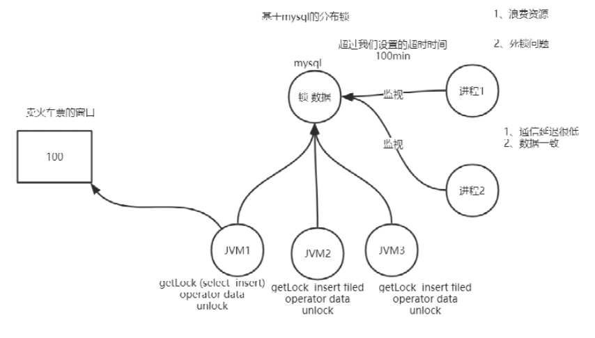
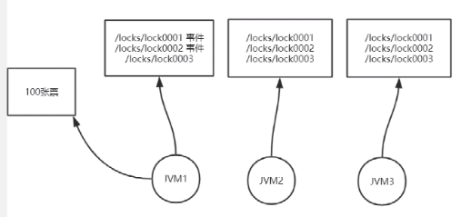

## 分布式锁原因

1. 共享资源
2. 共享资源互斥
3. 多任务环境

单机多线程同样具有以上特点，但是同一jvm内，可以通过加锁解决这些问题

对于分布式系统，各子系统运行在不同的jvm中，需要分布式锁进行问题解决。

## 分布式锁实现

### 基于mysql的分布式锁

此种方案的问题

1. 浪费资源
2. 死锁问题，假如当前获取锁的进程死亡，将造成死锁
3. 为解决死锁，增加监视进程，若二者都出现问题，依旧会产生死锁
4. 使用两个监视进程，但是两个进程如何通信？如何保持数据一致
5. 如何恰当设置进程的超时时间
   1. 假如时间过短，获锁的进程出现卡顿（jvm），监视进程剥夺锁，其他进程获锁，则会出现两个进程同事对资源进行修改
   2. 若时间过长，获取的进程很快死亡，仍需等到时间耗尽

### redis 分布式锁

思路与mysql方式相似，问题在于如何设置超时时间

### zookeeper 分布式锁

zookeeper：分布式一致性服务架构

1. 统一视图
2. 可以存储数据，文件系统zookeeper目录可以存储数据
3. 目录类型
   1. 持久化；客户端断开连击后节点不会删除
   2. 临时 -e
   3. 持久有序 -s
   4. 临时有序
4. 支持事件回调

#### 分布式锁

实现方式：客户端在zk节点上进行注册，按照注册顺序进行执行，当前执行节点的下一个节点会在此节点注册回调事件，当前节点执行完毕后，调用事件

优点：

1. 节省资源，不需要就行循环检查
2. 通过有序临时节点和事件通知机制巧妙的解决了死锁问题。jvm1挂了后，zk上会将节点删除，事件会通知下一个jvm

